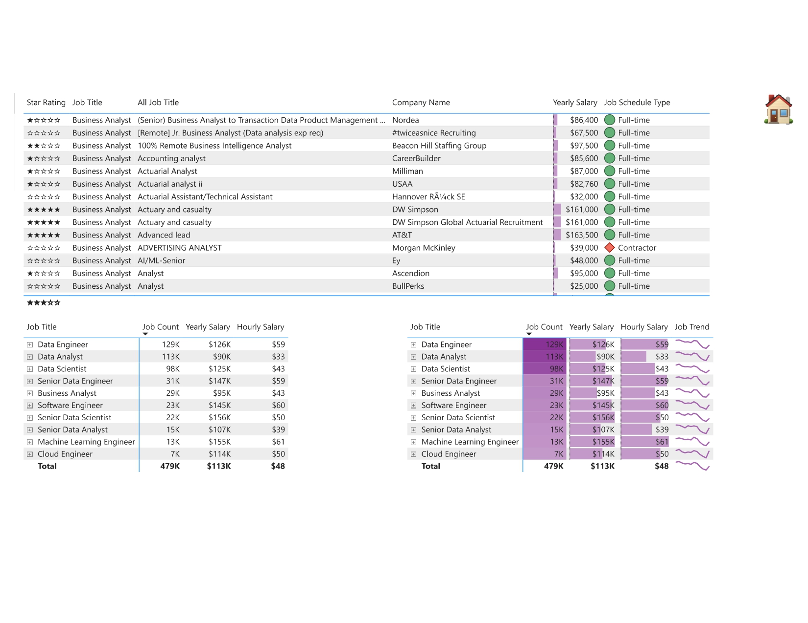
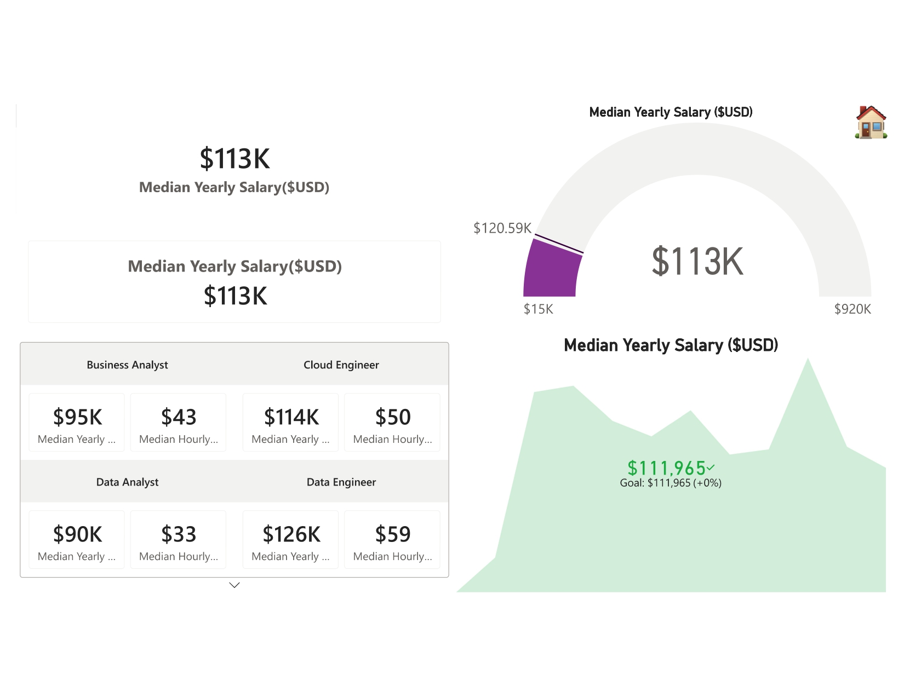
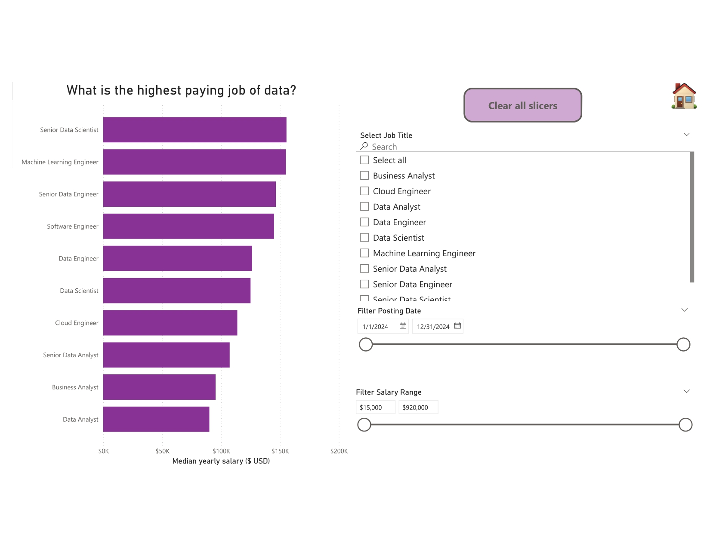

# Part 1: Visualizations + Project #1

[← Back to main README](../README.md)

Covers the Visualizations chapter of Luke Barousse's Power BI course and **Project #1: Data Jobs Dashboard**. Dataset: `job_postings_flat`.

## Preview

### Project #1: Data Jobs Dashboard

### Project #1: Job Title Drill Through

## Page Gallery

| | |
|---|---|
|  **1. Column & Bar Charts** Bar, clustered column, stacked and 100% stacked charts comparing median salaries and no-degree postings by job title |  **2. Line & Area Charts** Job posting trends across 2024, with trend lines, drill-down, stacked area, and a column + line combo chart |
|  **3. Common Charts** Pie, donut, treemap and scatter plot showing no-degree share, WFH share, job types, and hourly vs yearly salary |  **4. Map Charts** Bubble map and filled map showing where data jobs are posted globally |
|  **5. Uncommon Charts** Ribbon chart for salary rank over time, plus waterfall and funnel charts |  **6. Tables & Matrices** Table with star-rating measure and icons, plus matrices with data bars, gradients and sparklines |
|  **7. Cards** Card, new card, multi-row card, gauge and KPI visuals for headline salary numbers |  **8. Slicers** List, dropdown and date and salary range slicers with a clear-all-slicers button |

## Files
- 📁 `Images/`: screenshots of every page
- 📊 `Visualization Section.pbix`: the full Power BI report (open with Power BI Desktop)

## What I built, and what I changed

| Page | Chart types | What I did |
|------|-------------|------------|
| 1. Highest Paying & No-Degree Jobs | Bar chart, clustered column, stacked bar, 100% stacked bar | Followed the course build exactly |
| 2. Job Trends in 2024 | Line chart, area chart, stacked area chart | Followed the line/area chart builds from the course; **added the stacked area chart ("What is trend of data job in 2024?") myself**. The technique was taught in the course but this specific visual wasn't built by the instructor, so I applied it independently |
| 3. Common Chart Types | Pie chart, donut chart, scatter plot, treemap | Followed the course build, but **changed the color theme/palette** from the original |
| 4. Global Job Postings (Maps) | Dot map, filled/shape map | Course covers 3 map types including an ArcGIS map; **I completed 2 of 3**. The ArcGIS map returned an error on my setup, which appears to require Power BI Premium (the instructor mentions this as a possible limitation) |
| 5. Uncommon Charts | Ribbon chart, waterfall chart, funnel chart | Followed the course build; changed the color theme/palette |
| 6. Tables & Matrices | Table, matrix, star-rating quick measure, conditional formatting (data bars, icons, gradients), sparklines | Followed the course build; changed the color theme/palette |
| 7. Cards | Card, new card, multi-row card, gauge, KPI | Followed the course build |
| 8. Slicers | Vertical list, tile, dropdown, between-range slicers, sync slicers, clear-all-slicers button | Followed the course build |
| 9. Buttons & Bookmarks | Page navigator, back/home button, bookmark-controlled slicer toggle | Followed the course build |
| **Project #1: Data Jobs Dashboard** | KPI cards, trend line, scatter plot, bar chart, matrix table + a **drill-through page** per job title | Followed the course structure and layout principles; applied a custom purple theme throughout |

## Next
➡️ [Part 2: Power Query](../02-Power-Query/)
